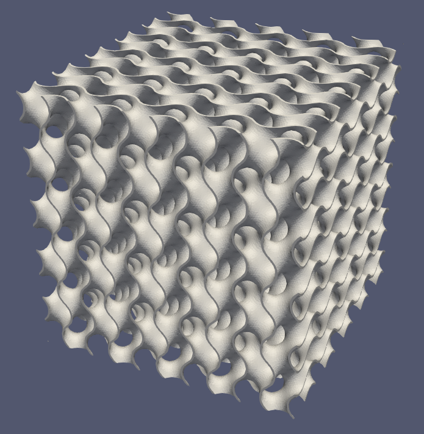
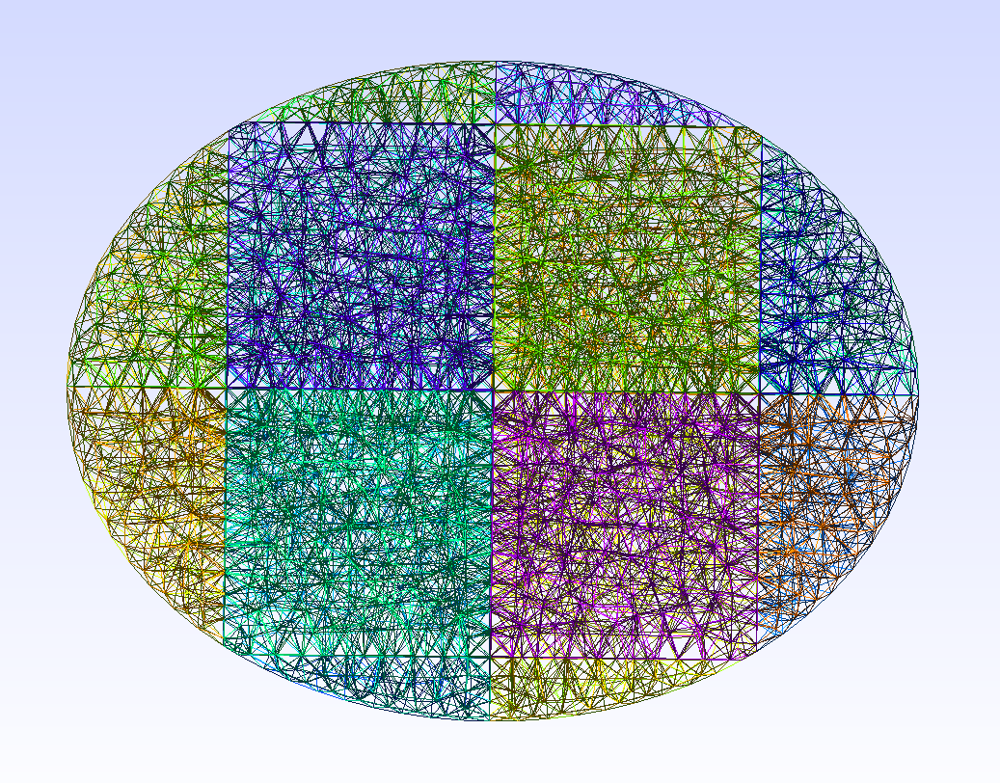
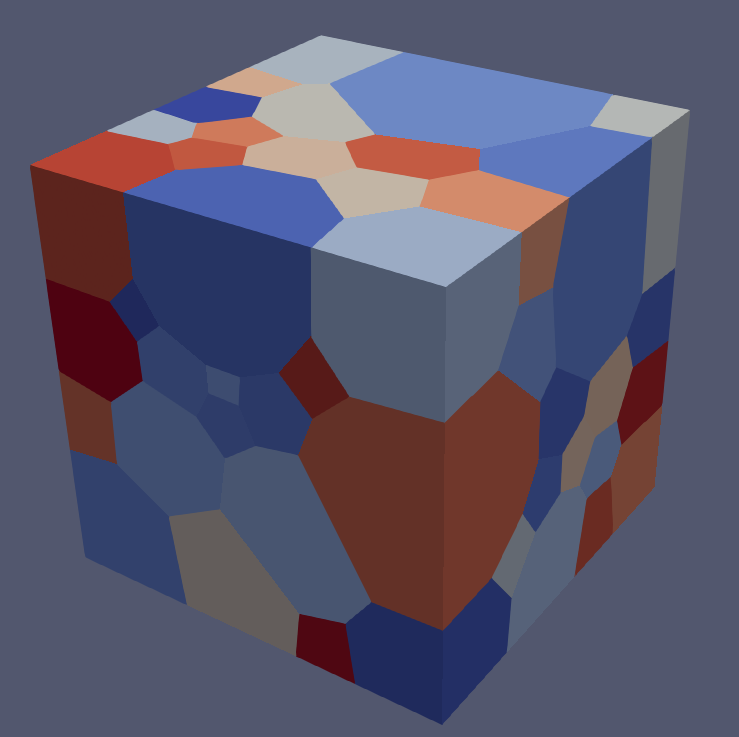
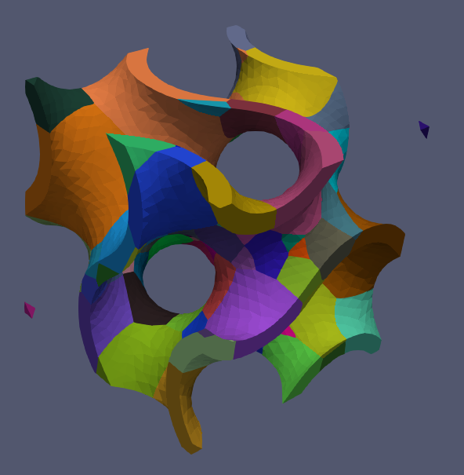

.. _RST 3Dop:

3D operations
====================================

Repeating unit geometry
-----------------------

.. include:: ../../examples/newExamples/repeatGeom/repeat.py
   :literal:

Raster Ellipsoid
----------------

.. include:: ../../examples/rasterEllipsoid/rasterEllipsoid.py
   :literal:

Voronoi
-------

.. include:: ../../examples/Voronoi/testNeper.py
   :literal:

Voronoi gyroid
--------------

.. include:: ../../examples/newExamples/VoronoiGyroid/voronoi_gyroid.py
   :literal:

