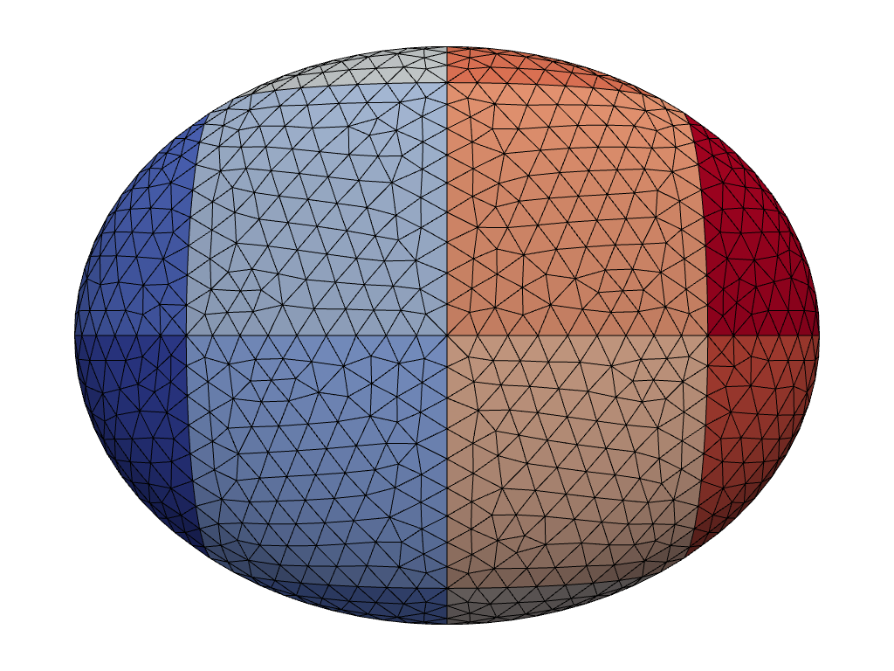

.. _RST 3Dop:

3D operations
====================================

Repeating unit geometry
-----------------------

.. include:: ../../examples/3Doperations/repeatShape/repeatShape.py
   :literal:

.. image:: ../_static/examples/repeated_geometry.png

Raster Ellipsoid
----------------

.. include:: ../../examples/3Doperations/rasterEllipsoid/rasterEllipsoid.py
   :literal:

Voronoi
-------

.. include:: ../../examples/3Doperations/voronoi/voronoi.py
   :literal:

.. image:: ../_static/examples/Voronoi.png

Voronoi gyroid
--------------

.. include:: ../../examples/3Doperations/voronoiGyroid/voronoiGyroid.py
   :literal:

.. image:: ../_static/examples/Gyroid-voro.png
