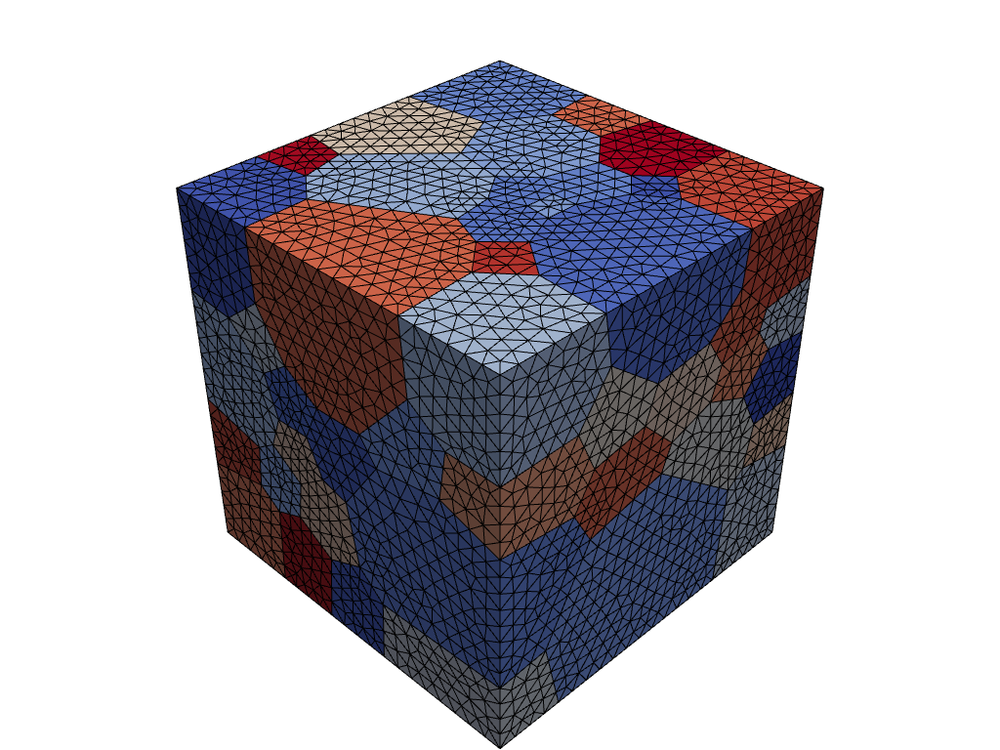
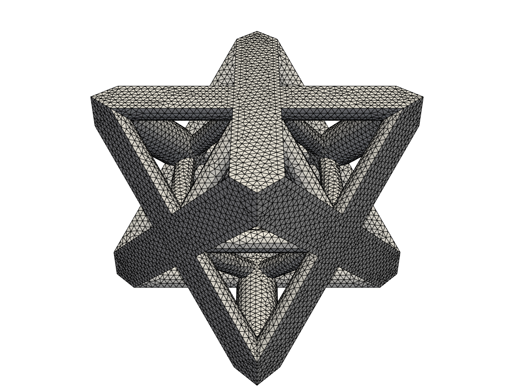
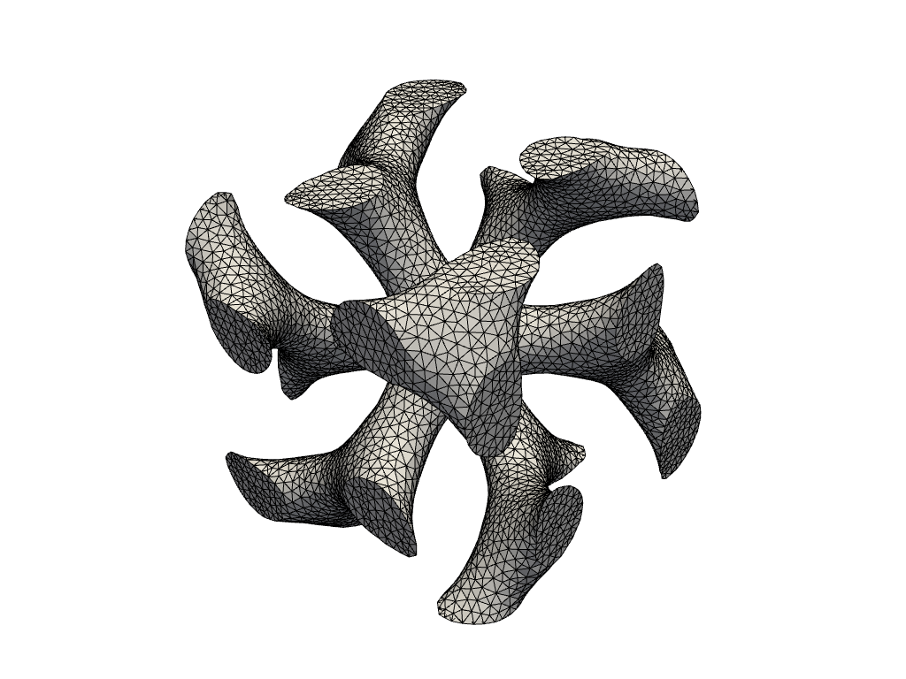
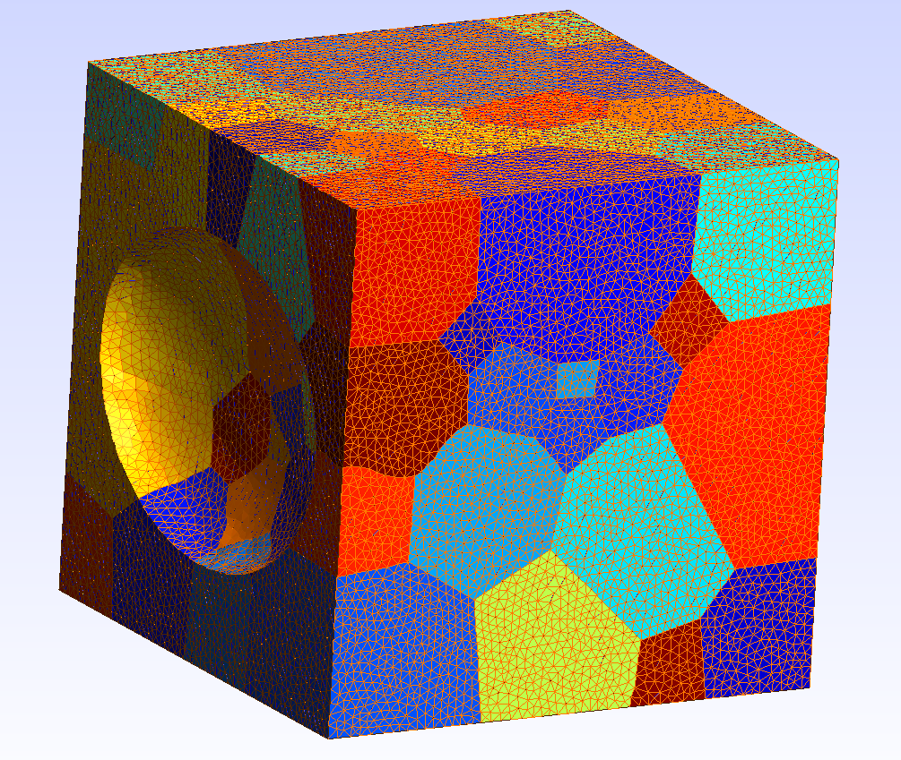
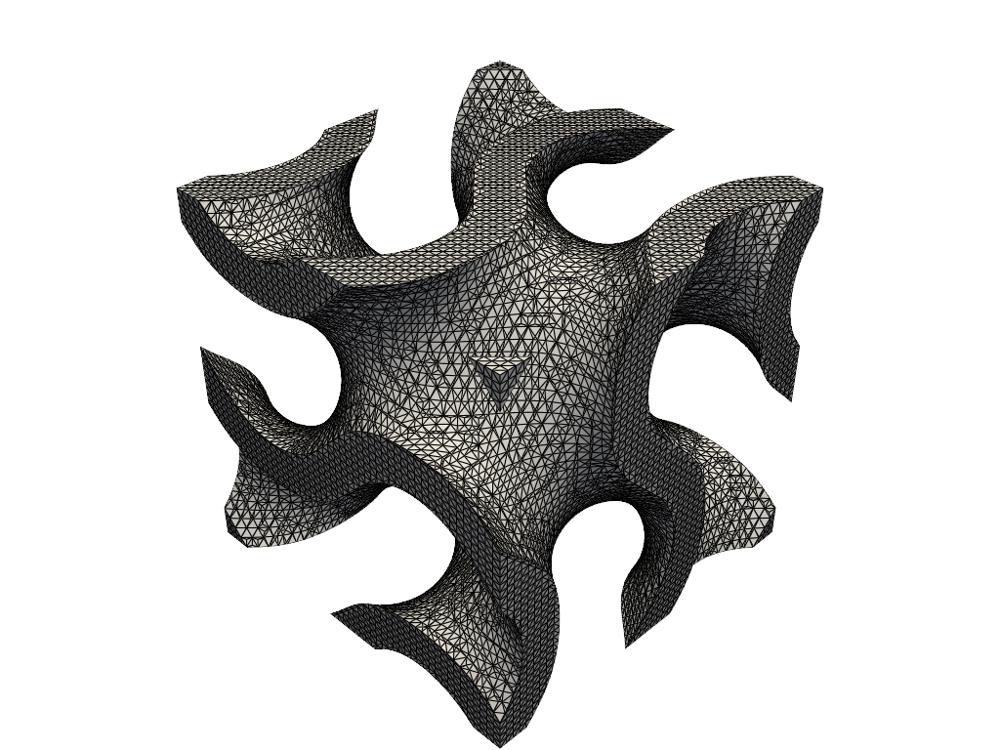

.. _RST Mesh:

Mesh
====================================

Mesh
-------

.. include:: ../../examples/3Doperations/voronoi/voronoi.py
   :literal:

Periodic Mesh
-------------

.. include:: ../../examples/Lattices/octetTruss/octetTruss.py
   :literal:

mmg
---

.. include:: ../../examples/Mesh/mmg/mmg3d.py
   :literal:

mmg Voronoi
-----------

.. include:: ../../examples/Mesh/mmg-voro/mmg.py
   :literal:

Periodic remeshing
------------------

.. include:: ../../examples/Mesh/remesh/remesh.py
   :literal:

