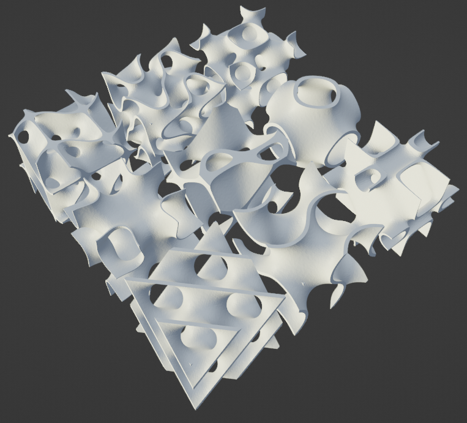
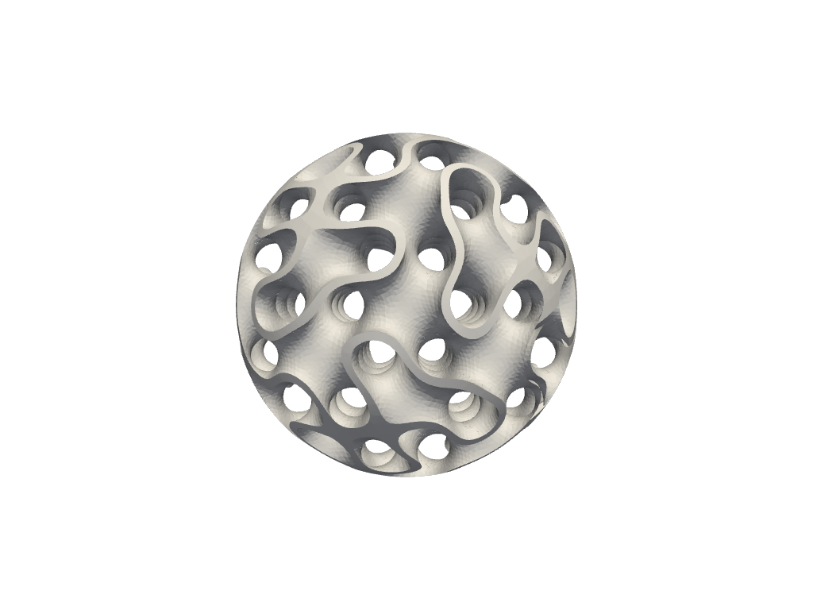
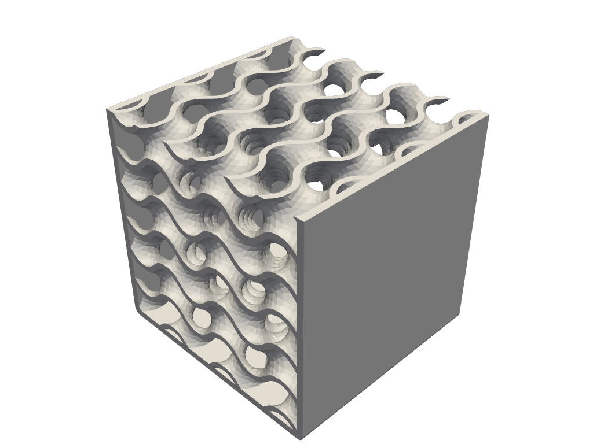

.. _RST Tpms:

Triply Periodic Minimal Surfaces (TPMS)
=======================================

Gyroid
--------------

.. include:: ../../examples/TPMS/gyroid/gyroid.py
   :literal:

.. image:: ../_static/examples/gyroid.png

TPMS available
--------------

.. include:: ../../examples/TPMS/tpms/tpms.py
   :literal:

Spherical gyroid
-----------------------

.. include:: ../../examples/TPMS/tpmsSphere/tpmsSphere.py
   :literal:

Shell
---------

.. include:: ../../examples/TPMS/tpmsShell/tpmsShell.py
   :literal:

